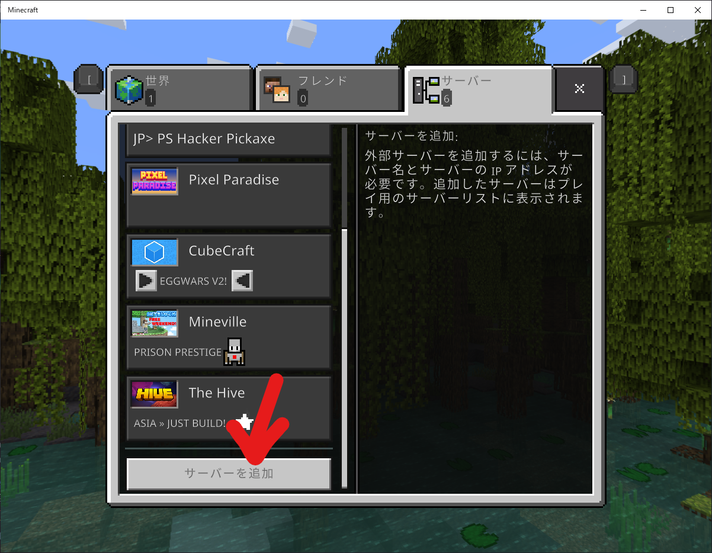
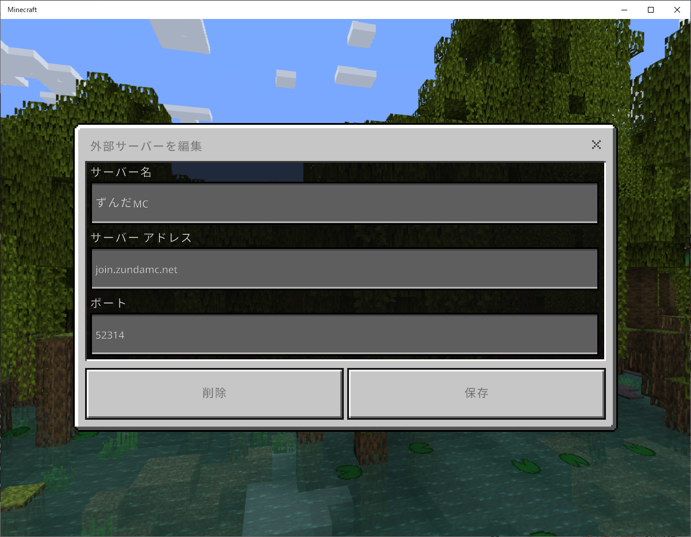
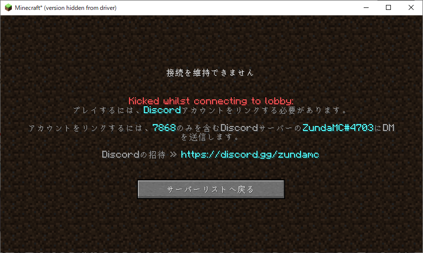
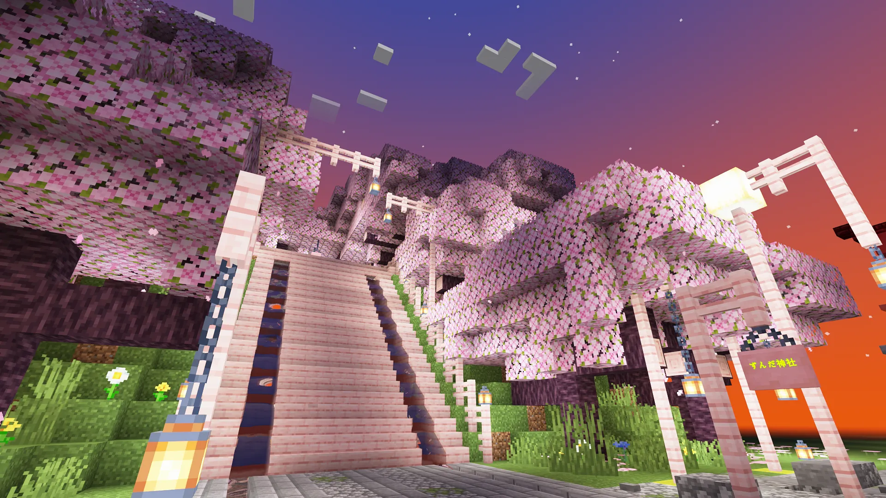

サーバーに入る方法をこのページでは解説します。
## サーバーの追加
サーバーリストにずんだMCを追加します。
### Java Edition
<figure markdown>
  {width="600"}
  <figcaption>サーバーを追加をクリックする</figcaption>
</figure>
<figure markdown>
  {width="600"}
  <figcaption>サーバーの名前はわかる名前にします。サーバーアドレスは 「play.zundamc.net」にして、完了をクリックします。</figcaption>
</figure>
???+ note
    ダイレクト接続を使うと、そのままサーバーへ参加することができますが、リストには追加されません。
### 統合版
<figure markdown>
  {width="600"}
  <figcaption>サーバーを追加をクリックする</figcaption>
</figure>
<figure markdown>
  {width="600"}
  <figcaption>サーバーの名前はわかる名前にします。サーバーアドレスは 「join.zundamc.net」にします。 ポートを52314にして、保存をクリックします。</figcaption>
</figure>
???+ note
    「遊ぶ」ボタンを押すと、そのままサーバーへ参加することができますが、リストには追加されません。
## サーバーに参加
サーバーに参加して、ずんだMCのハブまで行きます。
### Discord認証
サーバーに参加すると、このようなメッセージが表示されると思います。
<figure markdown>
  {width="600"}
  <figcaption>画像はJava版です</figcaption>
</figure>
[ずんだMCのDiscordサーバー](https://discord.gg/zundamc)に参加し、ZundaMCというボットのDMを開きます。
<figure markdown>
  {width="300"}
  <figcaption>このボットです</figcaption>
</figure>
そうしたら、認証コードをBOTのDMに送信します。認証コードは4桁で、数字です。 
上の画像では、認証コードは「7868」です。文字は青色で書かれています。
<figure markdown>
  {width="900"}
  <figcaption>ハブの画像</figcaption>
</figure>

