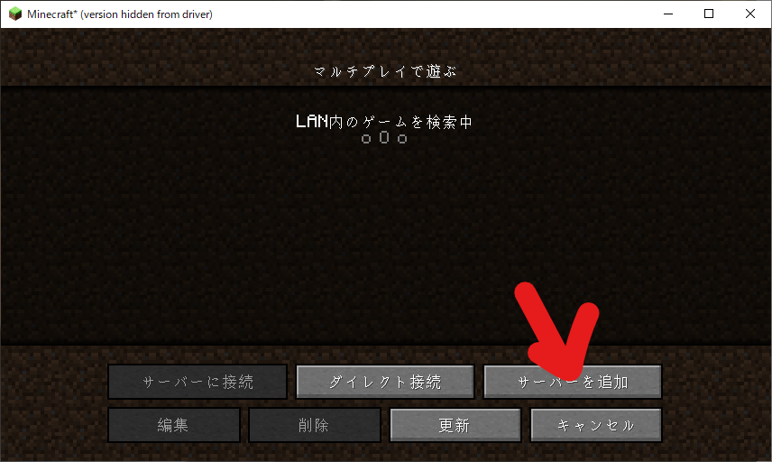
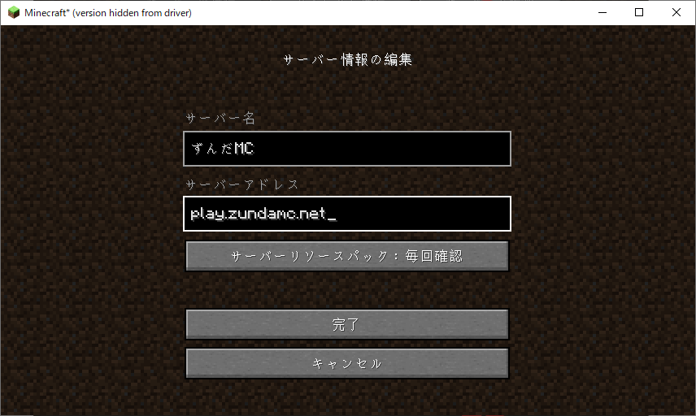
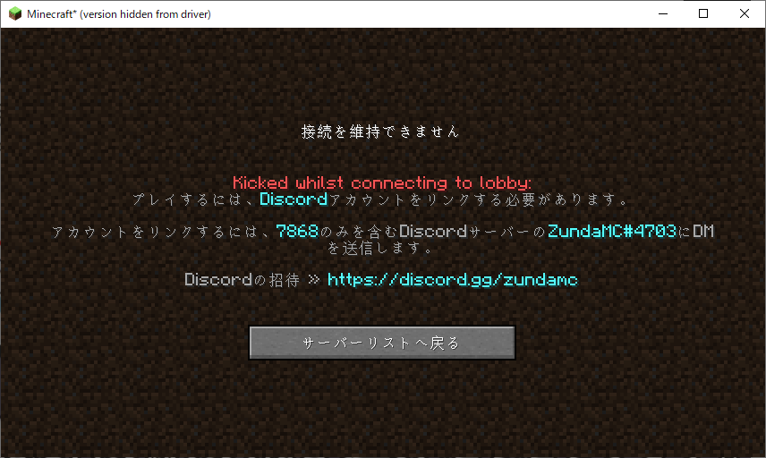

サーバーに入る方法をこのページでは解説します。
## サーバーの追加
サーバーリストにずんだMCを追加します。
### Java Edition
<figure markdown>
  {width="600"}
  <figcaption>サーバーを追加をクリックする</figcaption>
</figure>
<figure markdown>
  {width="600"}
  <figcaption>サーバーの名前はわかる名前にします。サーバーアドレスは 「play.zundamc.net」にして、完了をクリックします。</figcaption>
</figure>
???+ note
    ダイレクト接続を使うと、そのままサーバーへ参加することができますが、リストには追加されません。
### 統合版
本当に申し訳ございませんが、現在統合版を準備中です。準備が完了次第、また情報を発信します。
## サーバーに参加
サーバーに参加して、ずんだMCに入るまでを解説します。
### Discord認証
サーバーに参加すると、このようなメッセージが表示されると思います。
<figure markdown>
  {width="600"}
  <figcaption>画像はJava版です</figcaption>
</figure>
[ずんだMCのDiscordサーバー](https://discord.gg/zundamc)に参加し、質問の「プレイしているゲーム」にあるMinecraftをクリックします。 
???+ note
    すでに参加している場合は、上にある「チャンネル&ロール」から質問の「プレイしているゲーム」にあるMinecraftをクリックします。
そうしたら、「MC Server」カテゴリにある認証コードチャンネルを開きます。開いたら、認証コードを入力します。 
認証コードは必ず4桁で、数字です。上の画像では、認証コードは「7868」です。文字は青色で書かれています。

